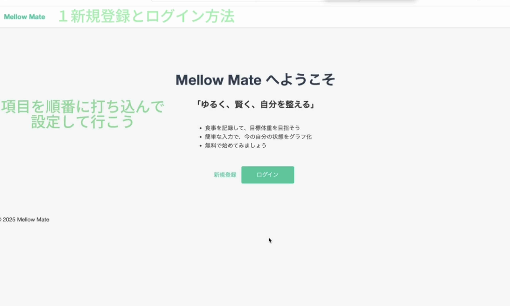
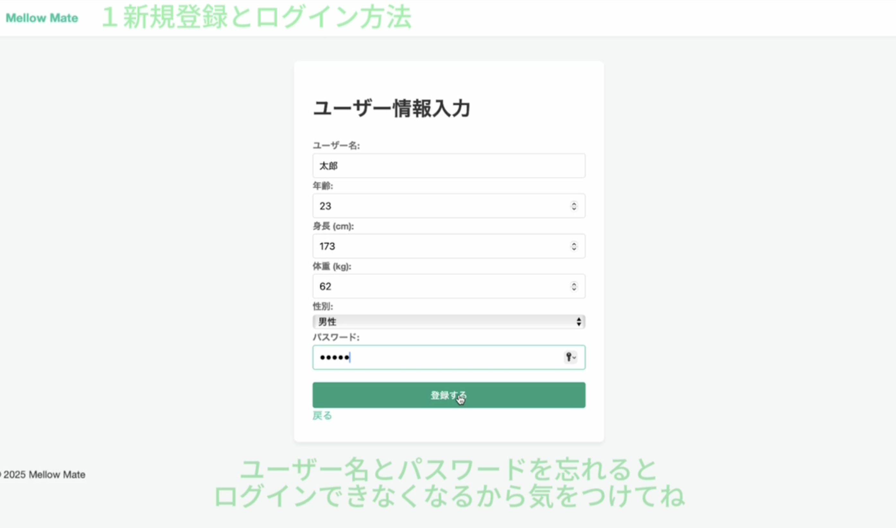
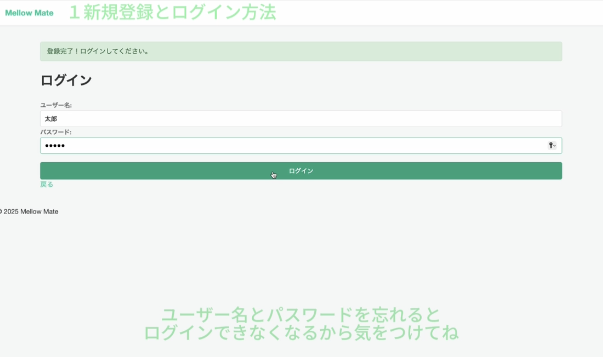
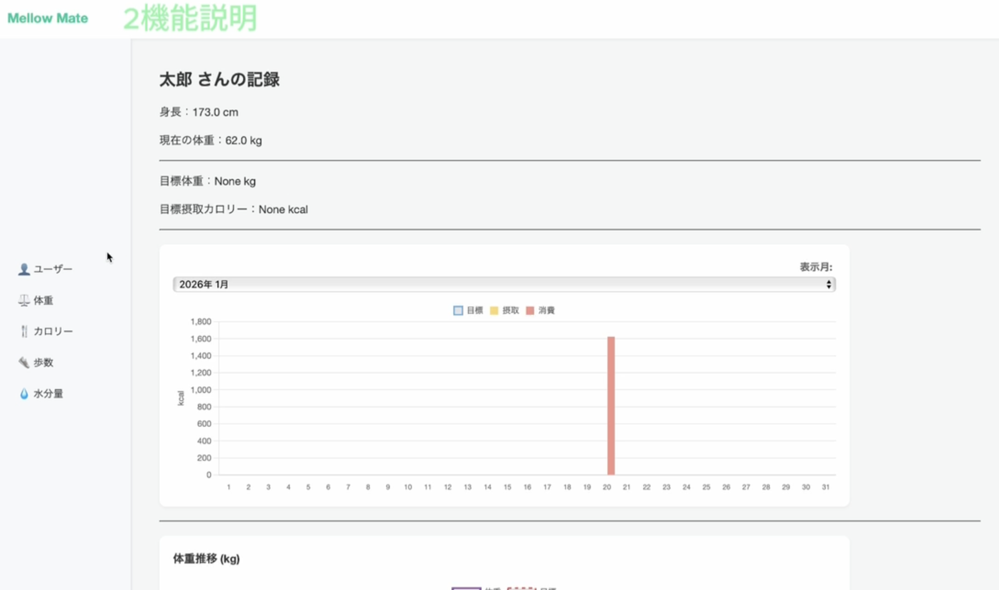
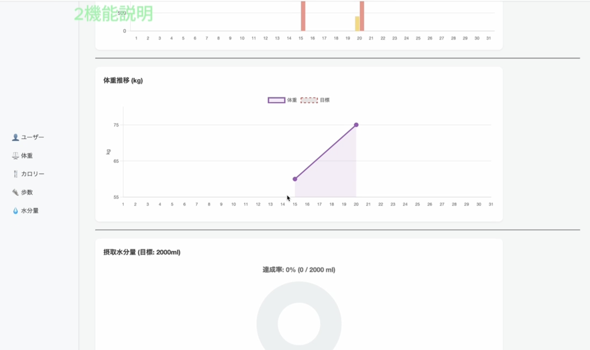
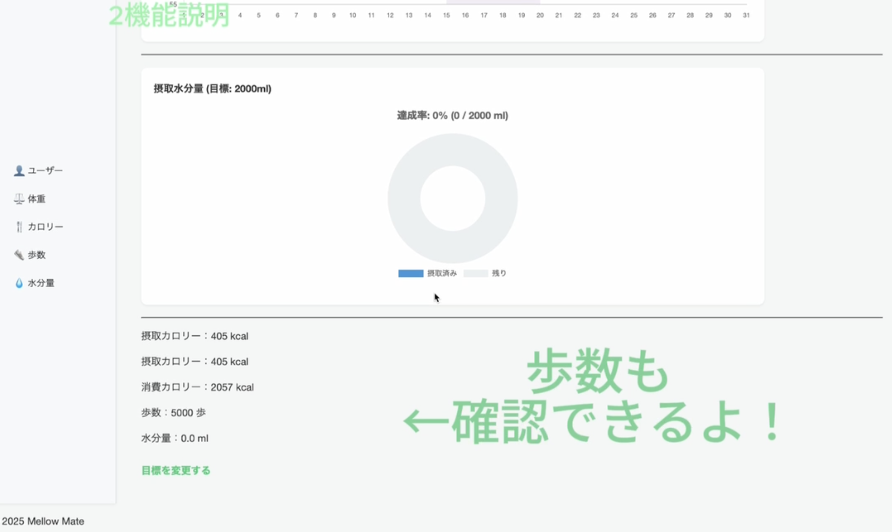

# アプリ名　　Mellow-Mate

## テーマ
「ゆるく、賢く、自分を整える」

## 概要
Mellow Mate は、食事・体重・歩数・水分摂取をシンプルに記録し、健康的な生活習慣をサポートするWebアプリケーションです。

## アピールポイント
- 一目でわかるダッシュボード：今日の摂取・消費カロリー、歩数、水分量などをグラフ、表で見える化。
- 体重も毎日記録可能！
前日との差や、目標からのズレもグラフにより見やすい。
- 賢いBMI判定:年齢、身長、体重を追加することであなたの健康状態を自動で判断。
- 摂取カロリーと消費カロリーを自分で登録するので、使用者に寄り添った設計。
- 柔軟なカロリー管理：朝・昼・夜の食事の記録で1日のカロリーを簡単に管理。
- 目標を自分で決められるので、初心者でも気軽にチャレンジできる。
- 安心のセキュリティ：アカウント登録をすることで、プライバシーを守りながら利用。

## アプリ画面
### スタート画面 / プロフィール入力画面
<p align="center">
  
  
</p>

### ログイン画面 / ホーム画面①
<p align="center">
  
  
</p>

### ホーム画面② / ホーム画面③
<p align="center">
  
  
</p>

## 使い方
### 1. 実行環境の準備
Python3.xがインストールされていることを確認してください。
### 2.ライブラリのインストール
```
'pip install flask flask-login peewee werkzeug'
```
### 3.プログラムの実行
```
'python app.py'
```
または▶︎の実行ボタンを押し、http://localhost:8080
にアクセスしてください。

## 操作ガイド
### 1.ユーザー登録（初回のみ）：
- 最初に**新規登録**ボタンをクリックします。
- 自分のユーザー名とパスワードを登録します。
- 登録完了後、プロフィール設定ページに遷移します。
- 年齢や身長、体重、性別などを入力します。この情報から基礎代謝を自動的に計算します。
- **登録する**ボタンを押して登録完了です。

### 2.ログイン（以下は次回以降）：
- ユーザー名とパスワードを入力してログインします。

### 3.目標設定：
- ダッシュボード下部の**目標を変更する**ボタンをクリックします。
- 移動後、目標の体重と1日の摂取カロリーを入力します。

### 4.日々の記録（サイドバーの操作）：
- 1日ごとの詳細を記録することができます。
- カロリー：食べたものを選んで登録します。リストにないものは「食べ物を追加」から新しく作れます。
- 歩数：その日の歩数を入力することで、消費カロリーが自動計算されます。
- 水分量：飲んだ量を記入することができます。
- ユーザーをクリックすると、ユーザー名・身長・性別・年齢の変更ができます。
- 体重をクリックすると、体重の記録ができ日付の選択で各日にちの記録までできます。

## 画面遷移
- スタート画面 → 新規登録+プロフィール設定 → ログイン画面 → ダッシュボード
- スタート画面 → ログイン画面 → ダッシュボード
- ダッシュボード → 各記録画面（カロリー / 歩数 / 水分 / 体重）
- ダッシュボード → 目標設定
- ダッシュボード → ユーザー設定

## 技術構成
### バックエンド
- Python 3.13.7
- Flask（3.1.2）：Webアプリケーションフレームワーク
- Flask-Login（0.6.3）：ユーザー認証
- SQLite：データベース
- Peewee（3.18.3）：ORM、データベース操作の簡略化
- Werkzeug（3.1.3）：パスワード認証、ハッシュ化

### フロントエンド
- HTML5：テンプレートエンジン：Jinja2
- CSS3：スタイリング
- JavaScript：Chart.js によるグラフ表示

## ファイル構成
```
Mellow-Mate/
├── app.py           # Flaskメインアプリケーション
├── db_manager.py    # データベース管理（Peeweeモデル）
├── utils.py         # ユーティリティ関数（カロリー計算等）
├── health.db        # SQLiteデータベース
│
├── static/ # 静的ファイル
│ ├── css/
│ │ ├── auth.css      # 認証ページ用css
│ │ ├── dashboard.css # ダッシュボード用css
│ │ └── style.css     # 全体用css
│ │
│ └── js/
│ ├── chart.js # グラフ表示機能
│ └── main.js  # メインスクリプト
│
├── templates/    # HTMLテンプレート（Jinja2）
│ ├── layout.html # ベーステンプレート
│ ├── index.html  # トップページテンプレート
│ │
│ ├── auth/
│ │ ├── login.html         # ログインページ
│ │ ├── register.html      # 登録ページ
│ │ └── profile_setup.html # プロフィール設定ページ
│ │
│ ├── main/
│ │ ├── dashboard.html # ダッシュボード
│ │ └── goals.html     # 目標設定ページ
│ │
│ ├── tracking/
│ │ ├── calories.html    # カロリー記録
│ │ ├── input_food.html  # 食べ物入力
│ │ ├── stepCount.html   # 歩数記録
│ │ ├── waterIntake.html # 水分摂取記録
│ │ └── weight.html      # 体重記録
│ │
│ └── user/
│ └── settings.html # ユーザー設定
│
├── utils/
│ └── bmi_calculator.py # BMI計算機
│
├── .gitignore # Gitignore設定
└── README.md  # このアプリの説明
```

## 作業分担

|レイヤー|役割|主担当|副担当|
|-------|---------|---------|---------------|
|Core層|共通基盤の作成|[K24117西田詩音](https://github.com/shion4949)|----------|
|Auth層|認証、オンボーディング|[K24107中川雄斗](https://github.com/yuto265)|[K24117西田詩音](https://github.com/shion4949)|
|Main層|メイン機能、ハブ|[K24034 大野恵奈](https://github.com/s2xxoo)|[K21083 中川岬](https://github.com/Nakagawa1020)|
|Tracking層|記録、トラッキング|[K21083 中川岬](https://github.com/Nakagawa1020)|[K24034 大野恵奈](https://github.com/s2xxoo)|